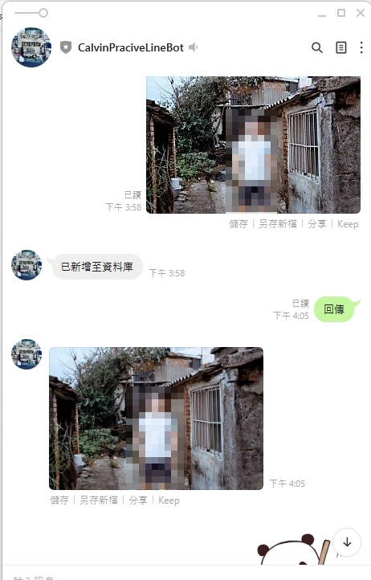

# Line Bot

A simple line bot save the last photo you send, which will save in sequelize database. With correct chat request, will send it back to you.

## Prerequisites

- Line app
- Line developer account
- Heroku
- Sequelize
- express
- imgur
- linebot

## preview image

- `send a photo`: after you send the photo, the robot will reply '以新增至資料庫'
- `ask for photo`: text '回傳' to the robot, it will reply the photo, if there is no photo will reply '資料庫內目前找不到相關資料'
- `other text`: The robot has default message with '輸入'回傳'，可回傳你最後一張發給我的圖片'
- `add photo failed`: When photos has failed saving, it will reply '資料新增失敗，請稍後再試'

### Author

[Calvin Huang](https://github.com/yuchengH1988)
